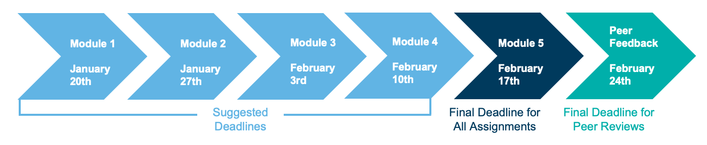

# Welcome 
Welcome to Planning for Monitoring and Evaluation! Before you get started, let's take a look at what you will learn in this course. 

## COURSE OVERVIEW 
How will you measure your project’s success? This course will help you answer this question by introducing the basics of monitoring and evaluation (M&E). In this course, you will learn how successful projects plan for data collection, management, analysis, and use. As you complete the course assignments, you will create an M&E plan for your own project. Here are the topics that will be covered in each module of the course:

- **Module 1**: Introduction to Monitoring and Evaluation
- **Module 2**: Linking M&E to Project Design
- **Module 3**: Identifying Indicators and Targets
- **Module 4**: Data Collection
- **Module 5**: Roles and Responsibilities

[View Syllabus]("documents/PhilanthropyU 00 -- 01 ME Training Syllabus.pdf")

## COURSE SCHEDULE 

### Schedule
We recommend that you complete one module per week. However, you will notice that you have access to all of the course content right now. This means that you could complete the course at a pace that is faster than one module per week. If you finish a module before the end of the week, go ahead and proceed to the next module! The course will close on February 24th at 11:59 Universal Coordinated Time (UTC), so make sure that you don’t go slower than one module per week. As you progress through each module of the course, your progress will be automatically saved.

## FINAL DEADLINE
All of your assignments for the course are due on February 17th, 2019, at 11:59 pm UTC, one week before the final course deadline. However, we suggest completing one module, and the associated assignments, every week.

All of your assignment peer reviews are due by the final course deadline, February 24th, 2019, at 11:59 pm UTC. In order to receive a Certificate of Achievement, you must complete your peer reviews by this time.