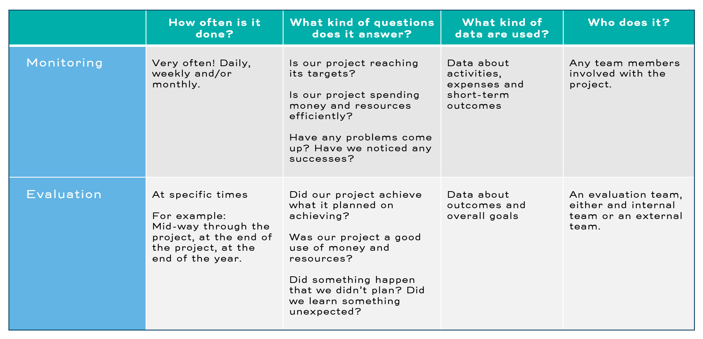

### Understanding M&E
# Understanding M&E 
Perhaps GOOD - the team with the M&E plan - reminds you of your project. If so, congratulations! Your M&E system is off to a great start. This course will help you to deepen your knowledge and improve your M&E plan.

However, you may find that your project more closely resembles MEH, the team without any M&E plan. If MEH reminds you of your project, don't worry! You are in exactly the right place. This course will help you plan for an existing project by: 
- Deeply understanding your project’s goals
- Deciding what to measure
- Developing tools and methods for measurement
- Figuring out which of your team members should collect, manage, analyze, and use data

By the end of this course you will have written and developed an M&E plan: a set of tools and documents to support your M&E system and guide your project to success. Before we start our work, however, let’s take a moment to really understand those two terms: monitoring and evaluation. 

## WHAT ARE “MONITORING AND EVALUATION?” 
When you were in school, you probably had a teacher who would give you feedback every few days. Daily, weekly, or monthly, she would check the work that you were doing, make comments, and help you out if she saw that you were having trouble. The same teacher might also, every few months, give you a grade or a mark that summarized how well you had done. 

The work that we do on projects is similar. Daily, weekly or monthly we check our projects to see how we are doing. This work is called monitoring, and it gives us the power to make informed decisions. Every few months - perhaps once a quarter, once a year, or at the end of a project - we take a look at all the work we have done, compare it to the original project plan and assess how successful we’ve been. This work is called evaluation. 

Monitoring and evaluation both depend on carefully collecting data about our project, thinking about what the data mean, and using the data to answer questions. **The difference between monitoring and evaluation is how often the data are used, the kinds of data that are looked at, and what the data are used for.**

Monitoring versus Evaluation Table

Monitoring data are used regularly: daily, weekly, or monthly. Monitoring data are used to answer questions such as: 

- Is our project reaching its targets?
- Is our project spending money and resources efficiently?
- Have any problems come up?
- Have we noticed any successes?

Evaluation data are only used at specific times. For example, evaluation data may be used every year, halfway through the project, or at the end of the project. Evaluation data are used to answer questions like: 

- Did our project achieve what it planned on achieving?
- Was our project a good use of money and resources?
- Did something happen that we didn’t plan?
- Did we learn something unexpected?

## TRY THIS:
Think about your project. What are some questions that you have? Could these questions be answered with data? Write down as many monitoring and evaluation questions as you can.

## ONE MORE NOTE ON M&E
Whether we’re talking about monitoring or evaluation, the overall approach is the same: we are collecting facts and data to inform our decisions. 

Let’s think about the example of the teacher again. Perhaps you can think of one teacher you had who had a reputation for being unfair. They gave their favorite students high scores, and they gave low scores to students that they disagreed with. This teacher let their biases - their beliefs about the world - get in the way of seeing how well students were really doing. 

We each have our own biases. These are our expectations for how the world should work or how our project should go. A strong M&E practice will allow us to be aware of our biases and to set them aside by collecting true, unbiased information. When used properly, M&E leads to better, less-biased project management. We call this approach evidence-based management. 

Throughout this course, we will be pushing you to think like an M&E expert by collecting data and testing your biases. 

## CHECK YOUR UNDERSTANDING
Checkboxes
10.0/10.0 points (graded)
The list below has several examples of monitoring activities, and several examples of evaluation activities. Select ALL of the monitoring activities.
- [ ] recording how much money your project is spending
- [ ] deciding whether your project was more effective than a different project
- [ ] discovering which part of your project made the biggest difference
- [ ] tracking how many people are participating in your project