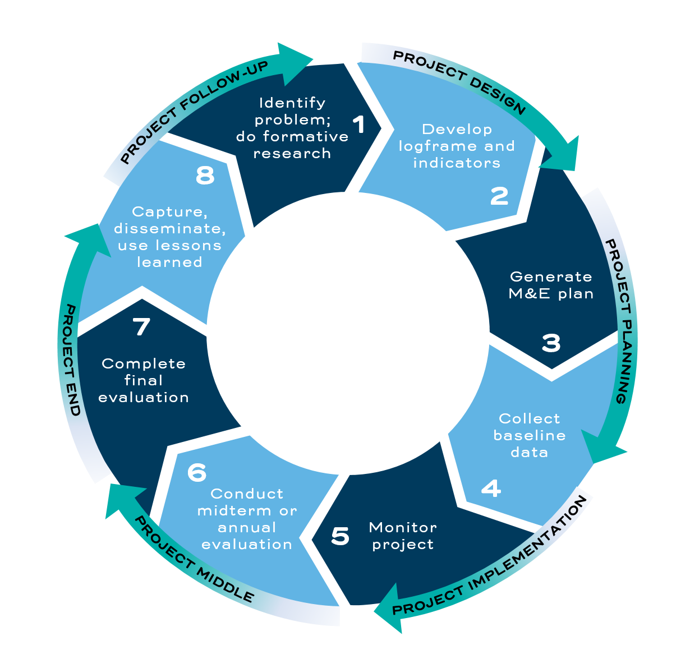

### The Project Cycle
# The Project Cycle 

Take a look at the graphic above. It shows the stages that every well-designed project should go through. Notice that it’s a circle, not a straight line. That is because as you go through a project you will learn a lot. What you learn will help with the development of the next project. That is why we call this the project cycle. 

M&E should be used at every stage of the project cycle. Organizations with great M&E systems start collecting data even before they decide what kind of project they are creating. This phase is called formative research, and it involves researching the problem that you would like to address. In the picture above, it is labeled as Step 1. Unfortunately, we will not have time to explore formative research in this course. 

This course will talk a bit about Step 2: Develop Logframe and Indicators. That is the step in the project cycle where you answer big questions like “what problem are we solving?” and “what activities and services will we provide?” 

We will spend most of our time on Step 3: Generate an M&E Plan. This is the part of the project cycle where you decide which information you will collect, how you will collect it, and what you will do with it. In fact, by the time you finish this course, you will have created most of the parts of your M&E plan. 

It is a good idea to focus on Step 3 because, if you create a great M&E plan, you will have a much easier time throughout the rest of our project cycle. 