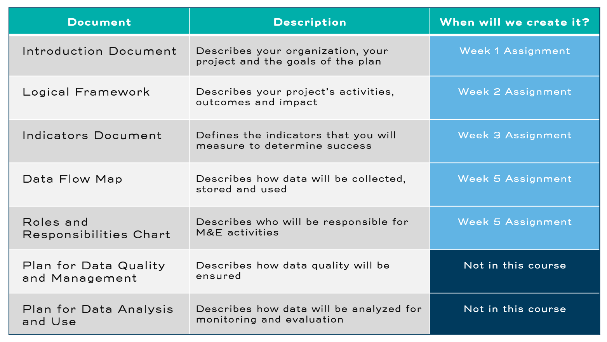
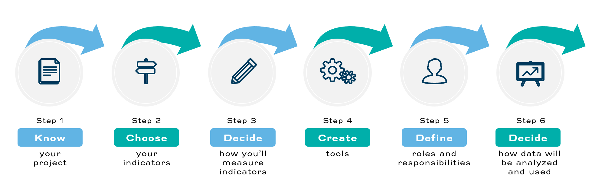

### Course Assignments and M&E Plan
# Course Assignments and M&E Plan 
Think of a project that you are working on. This could be a project that is starting soon, a project that has already started, or a project that you would like to start someday. If you are not working on anything, you will need to imagine a project that you would like to work on. Throughout this course, you are going to be building an M&E plan for this project. 

Let’s review the list of documents that usually go into an M&E plan: 
- Introduction Document
- Logical Framework (Logframe)
- Indicators Document
- Data Flow Map
- Roles and Responsibilities Chart
- Plan for Data Quality Management
- Plan for Data Analysis and Use

Note that this is not a complete list of everything that might be included in an M&E plan. Some organizations will want more detail on how you will conduct your evaluations or reporting, for example. 

In this course, you will create the first five documents in this list - Introduction Document, Logical Framework, Indicators Document, Data Flow Map, and Roles and Responsibilities Chart - as course assignments. The final two documents - Plan for Data Quality Management and Plan for Data Analysis and Use - we will not discuss in much detail. That is because these two documents require mastering some areas of M&E that we will not have the time to learn about. 

Course Assignments

## A LOOK AHEAD 
There are several steps to creating an M&E plan. Here is a look at the work we will do: 

Steps to setting up an M&E Plan

1. Know your project
 Your M&E plan is a set of tools that will help you measure progress towards your goals. That is why your first step is to understand exactly what those goals are. You will learn how to do this in Module 2. In this module, you will create a Logical Framework, also known as a Logframe.

2. Choose your indicators
 Indicators are the things that you measure. Sometimes your donors tell you what to measure and sometimes it is up to you, but typically it can be a bit of both. You will choose indicators in Module 3. In this module, you will create an Indicators Document.

3. Decide how you will measure your indicators
 There are many ways to collect data, and you will have to choose our methods carefully. You will make these decisions in Module 4.

4. Create tools
 Tools can be surveys on a computer or papers in a notebook. Either way, you will need to create your tools thoughtfully. You will create tools in Module 4. In this module, you will create a Participant Tracking Form.

5. Define responsibilities
 Collecting, managing, analyzing and using data will probably involve lots of people. You will decide who will do which tasks in Module 5. In this module, you will create a Roles and Responsibilities Chart and a Data Flow Map.

6. Decide how data will be analyzed and used
 Our final goal is to use our data to improve our project and to decide how successful it was. This is not a subject that we will be able to discuss fully in this course. However, you will begin to think about data analysis and use in Module 5.